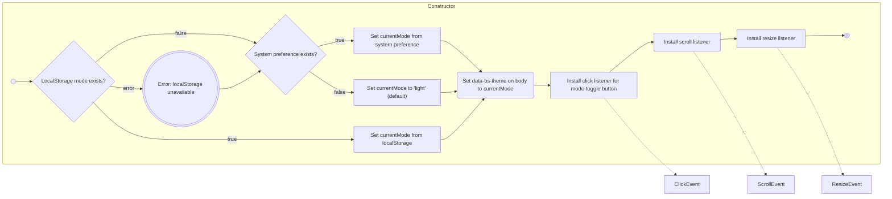
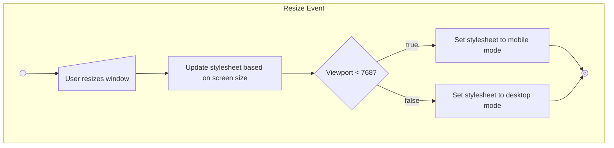
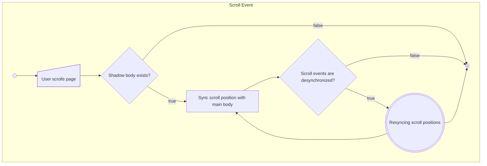

# mode-toggle

## Constructor

```mermaid
flowchart LR;

  subgraph C0["Constructor"]
  direction LR
    C0S@{ shape: sm-circ, label: "Start" }
    C0E@{ shape: stop, label: "End" }

    C0S --> B@{ shape: decision, label: "LocalStorage mode exists?" }
    
    B --true--> C@{ shape: process, label: "Set currentMode from localStorage" }
    B --false--> D@{ shape: decision, label: "System preference exists?" }
    
    D --true--> E@{ shape: process, label: "Set currentMode from system preference" }
    D --false--> F@{ shape: process, label: "Set currentMode to 'light' (default)" }
    
    B --error--> B1@{ shape: dbl-circ, label: "Error: localStorage unavailable" }
    B1 --> D  

    E --> G@{ shape: rounded, label: "Set data-bs-theme on body to currentMode" }
    F --> G
    C --> G

    G --> I@{ shape: process, label: "Install click listener for mode-toggle button" }
    I --> K@{ shape: process, label: "Install scroll listener" }
    K --> J@{ shape: process, label: "Install resize listener" }
    J --> C0E
  end
  I -.-> ClickEvent  
  J -.-> ResizeEvent  
  K -.-> ScrollEvent  

```

## Click Event Logic

```mermaid
flowchart LR;
  subgraph ClickEvent["Click Event"]
  direction LR
    CES@{ shape: sm-circ, label: "Start" }
    CEE@{ shape: stop, label: "End" }

    CES --> CI@{ shape: manual-input, label: "User clicks mode-toggle button" }
    CI --> O@{ shape: subproc, label: "Animate mode switch" }

    O --> P@{ shape: process, label: "Clone shadow body from template" }
    P --> P1@{ shape: decision, label: "Shadow body cloned successfully?" }
    P1 --false--> P2@{ shape: dbl-circ, label: "Error: Shadow body missing" }
    P2 --> CEE  

    P1 --true--> Q@{ shape: process, label: "Copy current body content into shadow body" }
    Q --> R@{ shape: process, label: "Apply opposite mode to shadow body" }
    R --> S@{ shape: process, label: "Apply shadow stylesheet" }

    S --> T@{ shape: tag-proc, label: "Apply circular clip-path animation" }
    T --> U@{ shape: decision, label: "Animation complete?" }
    U --true--> V@{ shape: process, label: "Toggle mode" }
    U --false--> T  

    V --> W@{ shape: process, label: "Set new mode on body" }
    W --> X@{ shape: process, label: "Save new mode to localStorage" }
    X --> Y@{ shape: process, label: "Update stylesheet based on new mode" }
    Y --> Z@{ shape: process, label: "Remove shadow body" }
    Z --> CEE  
  end
```

## Resize Event Logic

```mermaid
flowchart LR;
  subgraph ResizeEvent["Resize Event"]
  direction LR
    RES@{ shape: sm-circ, label: "Start" }
    REE@{ shape: stop, label: "End" }

    RES --> RJ@{ shape: manual-input, label: "User resizes window" }
    RJ --> L@{ shape: process, label: "Update stylesheet based on screen size" }

    L --> JA@{ shape: decision, label: "Viewport < 768?" }

    JA --true--> M@{ shape: process, label: "Set stylesheet to mobile mode" }
    JA --false--> N@{ shape: process, label: "Set stylesheet to desktop mode" }
    
    M --> REE  
    N --> REE  
  end
```

## Scroll Event Logic

```mermaid
flowchart LR;
  subgraph ScrollEvent["Scroll Event"]
  direction LR
    SES@{ shape: sm-circ, label: "Start" }
    SEE@{ shape: stop, label: "End" }

    SES --> SK@{ shape: manual-input, label: "User scrolls page" }
    SK --> KA@{ shape: decision, label: "Shadow body exists?" }

    KA --true--> KB@{ shape: process, label: "Sync scroll position with main body" }
    KA --false--> SEE  

    KB --> K1@{ shape: decision, label: "Scroll events are desynchronized?" }
    K1 --true--> K2@{ shape: dbl-circ, label: "Resyncing scroll positions" }
    K1 --false--> SEE  
    K2 --> KB  
    K2 --> SEE  
  end
```
